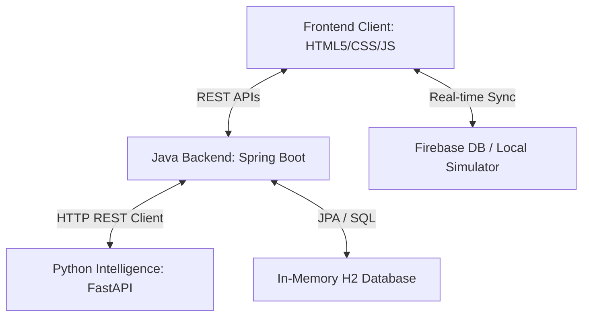

# MediSwift – Medicine Delivery Platform Summary

**MediSwift** is a full-stack, premium medicine delivery application that integrates a Spring Boot Java backend, a Python (FastAPI) intelligence microservice, and a dynamic, responsive single-page frontend. It offers features including user authentication, a medicine catalog, a shopping cart, a smart generic alternative recommender, a drug-drug safety interaction checker, prescription image OCR extraction, and real-time order tracking with a live canvas-animated route map.

---

## 🏗️ System Architecture & Data Flow

The project is split into three main layers:
1. **Frontend Client**: A single-page application built with HTML5, Vanilla CSS3 (custom CSS variables, glassmorphism, and responsive grid layouts), and Vanilla ES6+ JavaScript. It connects to the Java backend via REST APIs and synchronizes tracking/auth states using the Firebase Web SDK (which features an automatic local storage simulation fallback).
2. **Java REST Backend (Spring Boot 3.x)**: Handles business logic, order management, database persistence via Spring Data JPA and H2, and serves as the hosting server for static frontend files. It acts as an orchestrator, forwarding prescription and recommendation requests to the Python service.
3. **Python Intelligence Microservice (FastAPI)**: Serves as the AI intelligence unit. It processes uploaded prescription images (simulated OCR parser) to extract patient/medicine metadata and performs safety calculations (drug-drug interactions and generic cost-savings substitutes).



---

## 🌟 Core Features & Functional Details

### 1. Catalog & Medicine Browsing
*   **Dynamic Inventory**: Supports browsing over 23 high-quality medicines categorized across *Cardiology*, *Antibiotics*, *Pain Relievers*, *Diabetes*, *Gastrointestinal*, *Asthma*, *Mental Health*, *Baby Care*, *Women Care*, *OTC*, and *Personal Care*.
*   **Search and Filters**: Filter by category capsules or search dynamically using a debounced search input field.

### 2. Smart Generics Recommender (Python FastAPI Bridge)
*   **Cost-Savings Analysis**: When details of a brand-name drug (e.g., *Lipitor*, *Advil*, *Tylenol*, *Nexium*, *Ventolin*, *Zoloft*, *Glucophage*, *Synthroid*) are viewed, the frontend calls the recommendation API.
*   **One-Click Substitution**: Compares the price of the brand-name item against its generic equivalent (e.g., Lipitor at ₹450 vs. Atorvastatin at ₹112.50) and permits swapping it directly in the cart, saving up to 75%.

### 3. Drug-Drug Safety Interaction Checker
*   **Real-time Cart Audits**: Whenever a user has 2 or more medicines in their cart, the frontend automatically audits the drug names against a safety rule engine hosted on the Python backend.
*   **Severity Warnings**: Flags critical, severe, or moderate drug combinations, rendering warning panels directly in the cart drawer (e.g., Advil + Aspirin flags increased GI bleeding risks; Sildenafil + Nitroglycerin warning for severe hypotension).

### 4. Prescription OCR Parsing
*   **Automatic Extraction**: Users can upload a photo of a handwritten/printed prescription during checkout.
*   **Auto-Fill Cart**: The FastAPI service analyzes the file, extracts metadata (Patient Name, Date, Doctor, Hospital, and Medicine list), and gives the user a one-click button to autofill the shopping cart with the exact quantities and items prescribed.

### 5. Real-time Order Tracking & Animated Canvas Map
*   **Real-time Sync**: Placing an order creates a state node in the database and synchronizes it to Firebase Realtime Database.
*   **Courier Live Map**: The checkout triggers an interactive canvas-drawn map tracking dashboard. An animated courier icon travels along abstract street grids in real-time, matching status shifts (`CREATED` -> `PROCESSING` -> `SHIPPED` -> `DELIVERED`).
*   **Courier Console View**: Users signing in with the `courier` role get access to a special console where they can view pending orders and trigger status changes. A testing button is also provided for customers to automate the courier updates for self-testing.

---

## 📂 Codebase Directory Structure & Navigation

### 1. Java Backend (`/backend-java`)
The Java backend serves the REST APIs, seeds the database, and exposes order / medicine management.
*   **Controllers**:
    *   [MedicineController.java](file:///Users/sujaychandrareddy/rfp/backend-java/src/main/java/com/mediswift/backend_java/controller/MedicineController.java): Handles retrieval, category filtering, and searching of medicines.
    *   [OrderController.java](file:///Users/sujaychandrareddy/rfp/backend-java/src/main/java/com/mediswift/backend_java/controller/OrderController.java): Manages placing orders, updating tracking status, and user order history.
    *   [PrescriptionController.java](file:///Users/sujaychandrareddy/rfp/backend-java/src/main/java/com/mediswift/backend_java/controller/PrescriptionController.java): Forwards prescription images and queries for interactions to the Python backend.
*   **Services**:
    *   [PythonServiceClient.java](file:///Users/sujaychandrareddy/rfp/backend-java/src/main/java/com/mediswift/backend_java/service/PythonServiceClient.java): Uses Spring `RestTemplate` to request OCR analysis and generic recommendations from `http://localhost:8000`. Features an automatic Java-based mock fallback parser if the Python server is offline.
*   **Data Models & Seeding**:
    *   [DataInitializer.java](file:///Users/sujaychandrareddy/rfp/backend-java/src/main/java/com/mediswift/backend_java/config/DataInitializer.java): Seeds 23 premium products into H2 on startup.
    *   [Order.java](file:///Users/sujaychandrareddy/rfp/backend-java/src/main/java/com/mediswift/backend_java/model/Order.java) & [OrderItem.java](file:///Users/sujaychandrareddy/rfp/backend-java/src/main/java/com/mediswift/backend_java/model/OrderItem.java): Customer order entity schemas.
    *   [Medicine.java](file:///Users/sujaychandrareddy/rfp/backend-java/src/main/java/com/mediswift/backend_java/model/Medicine.java): Medicine inventory schema.
*   **Static UI Client (Resources)**:
    *   [index.html](file:///Users/sujaychandrareddy/rfp/backend-java/src/main/resources/static/index.html): Single-page HTML containing the auth, catalog, checkout, orders, and delivery panels.
    *   [style.css](file:///Users/sujaychandrareddy/rfp/backend-java/src/main/resources/static/css/style.css): Vanilla CSS containing the layout structure, glassmorphism tokens, and keyframe animations.
    *   [app.js](file:///Users/sujaychandrareddy/rfp/backend-java/src/main/resources/static/js/app.js): Core frontend engine managing cart interactions, checkout flow, Canvas-based map animations, and state transitions.
    *   [firebase-config.js](file:///Users/sujaychandrareddy/rfp/backend-java/src/main/resources/static/js/firebase-config.js): Handles Firebase configurations. If standard config keys are left blank, it automatically initializes a **Local Simulation Fallback** mapping database actions to `localStorage` / `sessionStorage` and trigger callbacks.

### 2. Python Intelligence Service (`/backend-python`)
A lightweight FastAPI application hosting the medical safety validation logic and prescription analysis.
*   [app.py](file:///Users/sujaychandrareddy/rfp/backend-python/app.py): Exposes POST endpoints for prescription image parsing and recommendation queries. Contains pre-defined drug-drug safety datasets and generic alternative mappings.
*   [requirements.txt](file:///Users/sujaychandrareddy/rfp/backend-python/requirements.txt): Lists microservice dependencies: `fastapi`, `uvicorn`, `pydantic`, and `python-multipart`.

---

## 🚀 Step-by-Step Local Deployment

To run and verify the entire system locally, execute the following commands in two terminal tabs:

### Tab 1: Start the Python Intelligence Service
```bash
cd backend-python
python3 -m venv venv
source venv/bin/activate
pip install -r requirements.txt
python app.py
```
*The FastAPI intelligence service will start on **`http://localhost:8000`**.*

### Tab 2: Start the Java REST Backend
```bash
cd backend-java
./mvnw spring-boot:run
```
*The Spring Boot server will compile the app and host it on **`http://localhost:8080`**.*

Once both services are running, navigate to **`http://localhost:8080`** in your browser to interact with the platform.
